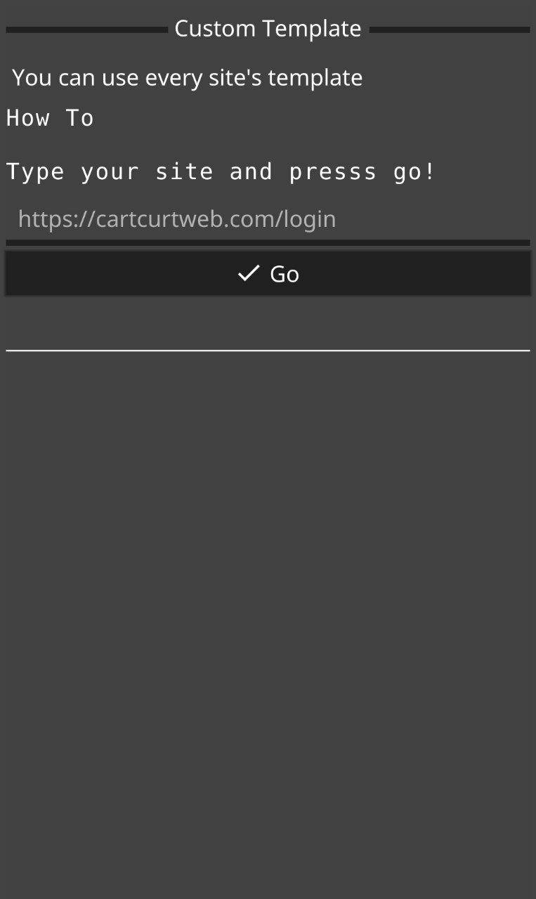

[![Forks][forks-shield]][forks-url]
[![Stargazers][stars-shield]][stars-url]
[![Issues][issues-shield]][issues-url]
[![GPL License][license-shield]][license-url]


<!-- PROJECT LOGO -->
<br />
<p align="center">
  <a href="https://github.com/codeksiyon/PhishDroid">
    
  </a>

  <h3 align="center">PhishDroid</h3>

  <p align="center">
    Simple Phishing Application for Android
    <br />
    <a href="https://github.com/codeksiyon/PhishDroid#ScreenShots"><strong>ScreenShots »</strong></a>
    <br />
    <br />
    .
    <a href="https://github.com/codeksiyon/PhishDroid/issues">Report Bug</a>
    ·
    <a href="https://github.com/codeksiyon/PhishDroid/issues">Request Feature</a>
  </p>
</p>


<!-- TABLE OF CONTENTS -->
## Table of Contents

* [About the Project](#about-the-project)
  * [Built With](#built-with)
* [Getting Started](#getting-started)
  * [Prerequisites](#prerequisites)
  * [Installation](#installation)
* [Usage](#usage)
* [Roadmap](#roadmap)
* [Contributing](#contributing)
* [License](#license)
* [Contact](#contact)
* [Acknowledgements](#acknowledgements)


<!-- ABOUT THE PROJECT -->
## About The Project

Codeksiyon's Simple Phishing Application
Under GPL3+

## DISCLAIMER

The use of the PhishDroid & its resources/phishing-pages is COMPLETE
RESPONSIBILITY of the END-USER. Developers assume NO liability and are NOT
responsible for any misuse or damage caused by this program. Also we inform you
that some of your your actions may be ILLEGAL and you CAN NOT use this
software to test person or company without WRITTEN PERMISSION from them.

<!-- GETTING STARTED -->
## Getting Started

To get a local copy up and running follow these simple steps.

### Prerequisites

This is an example of how to list things you need to use the software and how to install them.
* golang
```sh
apt install golang
```

### Installation

1. Clone the repo
```sh
git clone https://github.com/codeksiyon/PhishDroid.git
```
2. Install GoLang
```sh
apt install golang
```

3. Install fyne - surf - errHandler
```sh
go get fyne.io/fyne
go get github.com/headzoo/surf
go get github.com/raifpy/Go
...
```

4. Install fyne/cmd/fyne
```sh
go get fyne.io/cmd/fyne
```

5. Install Android NDK
```
https://developer.android.com/ndk/downloads
```

6. Move project $GOPATH
```sh
mv PhishDroid $GOPATH/src
cd $GOPATH/src/PhishDroid
```

7. Build for Android
```sh
fyne package -os android -appID "org.codeksiyon.phishdroid" . # all archs
fyne package -os android/arm -appID "org.codeksiyon.phishdroid" .
fyne package -os android/arm64 -appID "org.codeksiyon.phishdroid" .
```


<!-- ROADMAP -->
## Roadmap

See the [open issues](https://github.com/codeksiyon/PhishDroid/issues) for a list of proposed features (and known issues).


<!-- CONTRIBUTING -->
## Contributing

Contributions are what make the open source community such an amazing place to be learn, inspire, and create. Any contributions you make are **greatly appreciated**.

1. Fork the Project
2. Create your Feature Branch (`git checkout -b feature/AmazingFeature`)
3. Commit your Changes (`git commit -m 'Add some AmazingFeature'`)
4. Push to the Branch (`git push origin feature/AmazingFeature`)
5. Open a Pull Request


<!-- LICENSE -->
## License

Distributed under the GPL3 License. See `LICENSE` for more information.


<!-- CONTACT -->
## Contact

Telegram - [@raifpy](https://t.me/raifpy)

Project Link: [codeksiyon/PhishDroid](https://github.com/codeksiyon/PhishDroid)

Template Link : [Best-README-Template](https://github.com/othneildrew/Best-README-Template)


<!-- MARKDOWN LINKS & IMAGES -->
<!-- https://www.markdownguide.org/basic-syntax/#reference-style-links -->
[contributors-shield]: https://img.shields.io/github/contributors/codeksiyon/PhishDroid.svg?style=flat-square
[forks-shield]: https://img.shields.io/github/forks/codeksiyon/PhishDroid.svg?style=flat-square
[forks-url]: https://github.com/codeksiyon/PhishDroid/network/members
[stars-shield]: https://img.shields.io/github/stars/codeksiyon/PhishDroid.svg?style=flat-square
[stars-url]: https://github.com/codeksiyon/PhishDroid/stargazers
[issues-shield]: https://img.shields.io/github/issues/codeksiyon/PhishDroid.svg?style=flat-square
[issues-url]: https://github.com/codeksiyon/PhishDroid/issues
[license-shield]: https://img.shields.io/github/license/codeksiyon/PhishDroid.svg?style=flat-square
[license-url]: https://github.com/codeksiyon/PhishDroid/blob/master/LICENSE
[linkedin-shield]: https://img.shields.io/badge/-LinkedIn-black.svg?style=flat-square&logo=linkedin&colorB=555

[product-screenshot]: screenshot.png

## ScreenShots





